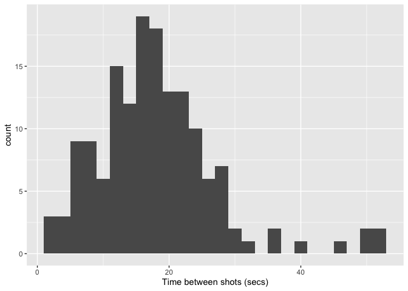

Introduction to Dates and Times in R
================
Your Name Here

  - [1. Using **lubridate** to calculate the dates of
    holidays](#using-lubridate-to-calculate-the-dates-of-holidays)
      - [Exercise 1](#exercise-1)
  - [2. The **lakers** data set](#the-lakers-data-set)
      - [Home and Away](#home-and-away)
      - [Distribution by Day of Week](#distribution-by-day-of-week)
      - [Exercise 2](#exercise-2)
      - [Exercise 3](#exercise-3)
      - [Distribution of Plays Througought the
        Game](#distribution-of-plays-througought-the-game)
      - [Analyzing a Single Game](#analyzing-a-single-game)
  - [3. On Your Own](#on-your-own)
      - [Exercise 4](#exercise-4)
      - [Exercise 5](#exercise-5)
  - [4. Lakers data set variables and
    descriptions](#lakers-data-set-variables-and-descriptions)
  - [5. Acknowledgement](#acknowledgement)

# 1\. Using **lubridate** to calculate the dates of holidays

Let’s get to know some of the commands in **lubridate** to calculate the
dates of holidays. Some holidays like Thanksgiving and Memorial Day do
not occur on the same date each year. We will use **lubridate** to find
the date on which Thanksgiving will fall in the year 2025.

First, note that Thanksgiving in the US is celebrated on the fourth
Thursday of November. Let’s start by getting a representation of the
first day of 2025.

``` r
(date <- ymd("2025-01-01"))
```

    ## [1] "2025-01-01"

Now add 10 months using the period function `month()` or directly set
the date to November:

``` r
(date <- date + months(10))
```

    ## [1] "2025-11-01"

Now check which day of the week November 1st is:

``` r
wday(date, label = TRUE, abbr = FALSE)
```

    ## [1] Saturday
    ## 7 Levels: Sunday < Monday < Tuesday < Wednesday < Thursday < ... < Saturday

This implies November 6th will be the first Thursday of November.

``` r
(date <- date + days(5))
```

    ## [1] "2025-11-06"

Next, we add three weeks to get to the fourth Thursday in November,
which will be Thanksgiving:

``` r
(date <- date + weeks(3))
```

    ## [1] "2025-11-27"

### Exercise 1

Follow the steps above to find the date for Thanksgiving in the year
2030.

# 2\. The **lakers** data set

The **lakers** data set contains play by play statistics of every NBA
regular season basketball game played by the Los Angeles Lakers during
the 2008-09 season. This data set accompanies the **lubridate** package
so there is no need to import it from an external source. (Note: The
data were originally sourced from <http://www.basketballgeek.com/data>
). But for convenience, the following code chunk converts it into a
tibble.

``` r
# The following command is useful if you need to re-run all commands during troubleshooting
# It removes previous versions of **lakers** from the local environment
rm(lakers)
```

    ## Warning in rm(lakers): object 'lakers' not found

``` r
# Convert the data set to a tibble for convenience  
lakers <- as_tibble(lakers)  
```

Use the `View()` command to look at the data set. For background, NBA
teams play 82 games per year, typically half of which are “at home” and
half are away. A regular game has 48 minutes split into 4 periods of 12
minutes each. Overtime periods, if required by a tie at the end of 48
minutes, are each 5 minutes in length.

This tutorial uses the **lubridate** functions to explore the
distribution of Lakers’ games throughout the year and the distributions
of plays within games. Each case (observation) is an individual “play”
which includes everything from a “jump ball” at the beginning of the
game to a “rebound” or “shot”. You can use `glimpse()` to look at the
variables but here is a list of the names with a brief description of
each:

You will see that the **lakers** data set has a variable *date* that
records the date of each game. Note from the output of `glimpse()` that
R recognizes the dates in this format as integers:

``` r
glimpse(lakers)
```

    ## Rows: 34,624
    ## Columns: 13
    ## $ date      <int> 20081028, 20081028, 20081028, 20081028, 20081028, 20081028,…
    ## $ opponent  <chr> "POR", "POR", "POR", "POR", "POR", "POR", "POR", "POR", "PO…
    ## $ game_type <chr> "home", "home", "home", "home", "home", "home", "home", "ho…
    ## $ time      <chr> "12:00", "11:39", "11:37", "11:25", "11:23", "11:22", "11:2…
    ## $ period    <int> 1, 1, 1, 1, 1, 1, 1, 1, 1, 1, 1, 1, 1, 1, 1, 1, 1, 1, 1, 1,…
    ## $ etype     <chr> "jump ball", "shot", "rebound", "shot", "rebound", "shot", …
    ## $ team      <chr> "OFF", "LAL", "LAL", "LAL", "LAL", "LAL", "POR", "LAL", "LA…
    ## $ player    <chr> "", "Pau Gasol", "Vladimir Radmanovic", "Derek Fisher", "Pa…
    ## $ result    <chr> "", "missed", "", "missed", "", "made", "", "made", "", "ma…
    ## $ points    <int> 0, 0, 0, 0, 0, 2, 0, 1, 0, 2, 2, 0, 0, 2, 2, 0, 0, 2, 0, 0,…
    ## $ type      <chr> "", "hook", "off", "layup", "off", "hook", "shooting", "", …
    ## $ x         <int> NA, 23, NA, 25, NA, 25, NA, NA, NA, 36, 30, 34, NA, 15, 46,…
    ## $ y         <int> NA, 13, NA, 6, NA, 10, NA, NA, NA, 21, 21, 10, NA, 17, 9, 1…

We can use the **lubridate** function to parse the dates into date-time
objects:

``` r
lakers <- mutate(lakers, date = ymd(date))
head(lakers)
```

    ## # A tibble: 6 x 13
    ##   date       opponent game_type time  period etype team  player result points
    ##   <date>     <chr>    <chr>     <chr>  <int> <chr> <chr> <chr>  <chr>   <int>
    ## 1 2008-10-28 POR      home      12:00      1 jump… OFF   ""     ""          0
    ## 2 2008-10-28 POR      home      11:39      1 shot  LAL   "Pau … "miss…      0
    ## 3 2008-10-28 POR      home      11:37      1 rebo… LAL   "Vlad… ""          0
    ## 4 2008-10-28 POR      home      11:25      1 shot  LAL   "Dere… "miss…      0
    ## 5 2008-10-28 POR      home      11:23      1 rebo… LAL   "Pau … ""          0
    ## 6 2008-10-28 POR      home      11:22      1 shot  LAL   "Pau … "made"      2
    ## # … with 3 more variables: type <chr>, x <int>, y <int>

## Home and Away

R now recognizes the dates as date-time-objects so that we can plot them
as dates which will be correctly displayed. One useful first step is to
plot the games over times and flag them as home or away:

``` r
# Don't worry about the y-scale
lakers %>% distinct(date, game_type) %>% 
  ggplot(aes(x = date, y = 0, color = game_type)) +
  geom_point()
```

<!-- -->

We can see that home and away games tend to cluster in streaks rather
than alternating every other game.  
We see breaks around the holiday season and for the all-star game in
February. The tick marks and breaks are automatically generated by
**lubridate**.

## Distribution by Day of Week

Lets consider how the games are distributed throughout the week. That
is, are games equally likely to be played on any day of the week or are
some more likely than others? Use the **lubridate** function `wday()` to
obtain the day of the week of each game.

``` r
lakers %>% 
  distinct(date) %>% 
  mutate(dayofwk = wday(date, label = TRUE, abbr = FALSE)) %>%
  ggplot(aes(x = dayofwk)) +
  geom_bar()
```

<!-- -->

## Exercise 2

On which day of the week is the largest number of games played? On which
two days are the least number of games played?

## Exercise 3

Repeat the analysis above but instead of day of week, look at the month
of the game. You should be able to adapt the code above but use the
`month()` function without abbreviation. Put the months in order of the
season which runs from October to April. Hint: You will probably need to
explicitly declare the month of the game as a factor for the appropriate
`fct_xxx()` reordering command to work. In which month(s) did the Lakers
play the most/least games?

## Distribution of Plays Througought the Game

Now let’s look at the play level data to see how the the plays are
distributed throughout the game. The **lakers** data set lists as *time*
the time that appears on the game clock for each play. These times begin
at the beginning of the period (at 12:00) and count down to 00:00 at the
end of the period. The first two digits show the minutes remaining while
the last two digits show the number of seconds remaining.

As the data were loaded, they are stored simply as character data and
have not yet been parsed as times or date-times. It would be difficult
to record the time data as a date-time object so use `ms()` to parse it
to a period object.

``` r
lakers <- lakers %>% 
  mutate(time = (ms(time)))
head(lakers)
```

    ## # A tibble: 6 x 13
    ##   date       opponent game_type time    period etype team  player result points
    ##   <date>     <chr>    <chr>     <Perio>  <int> <chr> <chr> <chr>  <chr>   <int>
    ## 1 2008-10-28 POR      home      12M 0S       1 jump… OFF   ""     ""          0
    ## 2 2008-10-28 POR      home      11M 39S      1 shot  LAL   "Pau … "miss…      0
    ## 3 2008-10-28 POR      home      11M 37S      1 rebo… LAL   "Vlad… ""          0
    ## 4 2008-10-28 POR      home      11M 25S      1 shot  LAL   "Dere… "miss…      0
    ## 5 2008-10-28 POR      home      11M 23S      1 rebo… LAL   "Pau … ""          0
    ## 6 2008-10-28 POR      home      11M 22S      1 shot  LAL   "Pau … "made"      2
    ## # … with 3 more variables: type <chr>, x <int>, y <int>

Since periods have relative lengths, it is dangerous to compare them to
each other. So we should next convert our periods to *durations* which
have exact lengths.

``` r
lakers <- lakers %>% 
  mutate(time = as.duration(time))
head(lakers)
```

    ## # A tibble: 6 x 13
    ##   date       opponent game_type time                  period etype team  player
    ##   <date>     <chr>    <chr>     <Duration>             <int> <chr> <chr> <chr> 
    ## 1 2008-10-28 POR      home      720s (~12 minutes)         1 jump… OFF   ""    
    ## 2 2008-10-28 POR      home      699s (~11.65 minutes)      1 shot  LAL   "Pau …
    ## 3 2008-10-28 POR      home      697s (~11.62 minutes)      1 rebo… LAL   "Vlad…
    ## 4 2008-10-28 POR      home      685s (~11.42 minutes)      1 shot  LAL   "Dere…
    ## 5 2008-10-28 POR      home      683s (~11.38 minutes)      1 rebo… LAL   "Pau …
    ## 6 2008-10-28 POR      home      682s (~11.37 minutes)      1 shot  LAL   "Pau …
    ## # … with 5 more variables: result <chr>, points <int>, type <chr>, x <int>,
    ## #   y <int>

See how the representation of *time* has changed? Unfortunately,
**ggplot2** will not plot a histogram of durations so we need to convert
time to a **period** for plotting purposes. (This appears to be
something of a bug since earlier work on **lubridate** suggests this
should be possible.)

For the current analysis, it will be useful to proceed to construct a
variable that represents the amount of time elapsed in the game
beginning at 0 and extending to the end of the game, up to 48 minutes
for a regular length game or 53 minutes for an overtime game. At the
start of each period, the game clocks counts down from 12:00. To
calculate how much play time elapses before each play, we subtract the
time that appears on the game clock from a duration of 12, 24, 36, 48,
or 53 minutes (depending on the period of play). We now have a new
duration that shows exactly how far into the game each play occurred.
You may need to study the code to understand how it’s working. It uses
indexing to grab the number of minutes corresponding to the period.

``` r
lakers <- lakers %>% 
  mutate(newtime =(dminutes(c(12, 24, 36, 48, 53)[period]) - time))
```

    ## Note: method with signature 'Duration#ANY' chosen for function '-',
    ##  target signature 'Duration#Duration'.
    ##  "ANY#Duration" would also be valid

``` r
str(lakers$newtime)
```

    ## Formal class 'Duration' [package "lubridate"] with 1 slot
    ##   ..@ .Data: num [1:34624] 0 21 23 35 37 38 38 38 60 67 ...

``` r
head(lakers)
```

    ## # A tibble: 6 x 14
    ##   date       opponent game_type time                  period etype team  player
    ##   <date>     <chr>    <chr>     <Duration>             <int> <chr> <chr> <chr> 
    ## 1 2008-10-28 POR      home      720s (~12 minutes)         1 jump… OFF   ""    
    ## 2 2008-10-28 POR      home      699s (~11.65 minutes)      1 shot  LAL   "Pau …
    ## 3 2008-10-28 POR      home      697s (~11.62 minutes)      1 rebo… LAL   "Vlad…
    ## 4 2008-10-28 POR      home      685s (~11.42 minutes)      1 shot  LAL   "Dere…
    ## 5 2008-10-28 POR      home      683s (~11.38 minutes)      1 rebo… LAL   "Pau …
    ## 6 2008-10-28 POR      home      682s (~11.37 minutes)      1 shot  LAL   "Pau …
    ## # … with 6 more variables: result <chr>, points <int>, type <chr>, x <int>,
    ## #   y <int>, newtime <Duration>

``` r
tail(lakers)
```

    ## # A tibble: 6 x 14
    ##   date       opponent game_type time  period etype team  player result points
    ##   <date>     <chr>    <chr>     <Dur>  <int> <chr> <chr> <chr>  <chr>   <int>
    ## 1 2009-04-14 UTA      home      42s        4 foul  LAL   Luke … ""          0
    ## 2 2009-04-14 UTA      home      42s        4 free… UTA   Kyle … "made"      1
    ## 3 2009-04-14 UTA      home      42s        4 free… UTA   Kyle … "made"      1
    ## 4 2009-04-14 UTA      home      27s        4 turn… LAL   Andre… ""          0
    ## 5 2009-04-14 UTA      home      21s        4 shot  UTA   Kyle … "miss…      0
    ## 6 2009-04-14 UTA      home      20s        4 rebo… LAL   Luke … ""          0
    ## # … with 4 more variables: type <chr>, x <int>, y <int>, newtime <Duration>

Now graph the number of plays by time period. We can use the `seconds()`
command to access seconds from the duration *newtime*.

``` r
lakers %>% 
  ggplot(aes(x = seconds(newtime))) + 
  geom_histogram(binwidth = 60)
```

<!-- -->

We can get an easier to read graph by converting to minutes.

``` r
lakers %>% 
  ggplot(aes(x = seconds(newtime)/60)) + 
  geom_histogram(breaks = 0:53) +
  scale_x_continuous(breaks = c(0, 12, 24, 36, 48, 53)) + 
  labs(x = "Minutes", y = "Plays")
```

<!-- -->

We see that the number of plays peaks within each of the four periods
and then drops at the beginning of each new period. The most plays occur
in the last minute of the game. Desperation shots and strategic fouling
may result in the large number of plays at the end of the game. Far
fewer plays occur in overtime since only a small portion of all games go
to overtime.

## Analyzing a Single Game

Now let’s see how we could look at just a single game, the game played
against the Boston Celtics on Christmas of 2008. We can quickly model
the amounts of time that occurred between each shot attempt.

``` r
# Filter for the game of interest
game1 <- lakers %>% 
  filter(date == ymd("20081225"))

# Filter for plays involving shot attempts and compute the time between shots using
# the lag function and the newtime duration variable. Remember that duration represents
# the cumulative time in seconds within the game at which the shot took place.
attempts <- game1 %>%
  filter(etype == "shot") %>%
  mutate(wait = newtime-lag(newtime))
```

With the data set **attempts** containing the duration variable *wait*,
we can plot a histogram of time between shots using the `seconds()`
function to access the seconds component. Use a reasonable binwidth to
get a detailed picture of the histogram.

``` r
# 
ggplot(attempts) +
  geom_histogram(aes(x = seconds(wait)), binwidth = 2)+
  labs(x = "Time between shots (secs)")
```

    ## Warning: Removed 1 rows containing non-finite values (stat_bin).

<!-- -->

Rarely did more than 30 seconds go by without a shot attempt.

One other analysis often of interest with game level data is to track
the score against elapsed time. We revisit some of the skills we learned
earlier in the term to filter out cases that do not produce points
(`team~= "OFF"`) and compute cumulative points for each time.

``` r
game1_scores <- game1 %>%
  filter(team != "OFF") %>%
  group_by(team) %>%
  mutate(score = cumsum(points))
ggplot(game1_scores, aes(x = seconds(newtime)/60, y = score, color = team))+ 
  geom_line() + 
  labs(x = "Minutes Elapsed", y = "Score")
```

<!-- -->

The game was fairly close throughout with the Lakers maintaining a lead
for most of the game They extended their lead right at the end of the
game.

# 3\. On Your Own

## Exercise 4

Pick a different game and repeat the analysis carried out above for the
game against Boston. Be sure you understand what the code is doing.

## Exercise 5

Come up with your own hypothesis and investigate it using the data
provided. Here are a few possible examples but you should try to come up
with your own:  
\* Are there more fouls in the last period (and overtime) than in other
periods? \* Is the distribution of time between fouls similar to or
different from the distribution of time between shots?  
\* Is the proportion of shots made higher in certain periods than
others?

# 4\. Lakers data set variables and descriptions

-----

|   Variable   | Description                                                                                                                                                                                                            |
| :----------: | ---------------------------------------------------------------------------------------------------------------------------------------------------------------------------------------------------------------------- |
|    *date*    | date of the game                                                                                                                                                                                                       |
|  *opponent*  | 3 letter abbreviation for the opposing team                                                                                                                                                                            |
| *game\_type* | whether the game was home or away                                                                                                                                                                                      |
|    *time*    | time remaining in the period                                                                                                                                                                                           |
|   *period*   | integer representing the period of the game (1 through 5 where 5 is overtime)                                                                                                                                          |
|   *etype*    | the general type of play (one of 10 possible types)                                                                                                                                                                    |
|    *team*    | team involved in the play which could be the home or away team or OFF meaning neither (time outs or jump balls)                                                                                                        |
|   *player*   | the player that made the play                                                                                                                                                                                          |
|   *result*   | outcome if the play was a shot (made or missed)                                                                                                                                                                        |
|   *points*   | number of points scored if a shot or free throws                                                                                                                                                                       |
|    *type*    | specific type of play or shot (one of 74 specific types)                                                                                                                                                               |
|   *x*, *y*   | x and y locations on the court (If you are standing behind the offensive team’s hoop then the X axis runs from left to right and the Y axis runs from bottom to top. The center of the hoop is located at (25, 5.25)). |

-----

# 5\. Acknowledgement

This tutorial adapts case studies appearing in Grolemund and Wickham in
“Dates and Times Made Easy with lubridate” appearing in the *Journal
of Statistical Software*, April 2011, Volume 40, Issue 3,
<http://www.jstatsoft.org/>.
