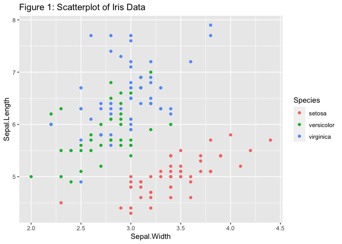

Introduction to Classification and Regression Trees (CART)
================

  - [1. Introduction](#introduction)
  - [2. Creating Classification Trees](#creating-classification-trees)
  - [3. How are CART Models Evaluated?](#how-are-cart-models-evaluated)
  - [4. Cross Validation](#cross-validation)
  - [5. Stopping Rules](#stopping-rules)
  - [6. Additional Resources](#additional-resources)
  - [7. Acknowledgements](#acknowledgements)

``` r
library(tidyverse)
library(modelr)
library(tree)
```

## 1\. Introduction

Classification and Regression Tree (CART) analysis is a very common
modeling technique used to make predictions of a response variable using
one or more explanatory variables. The term **Classification Tree** is
used when the response variable is categorical, while **Regression
Tree** is used when the response variable is continuous. CART analysis
is very common because it works well for a wide variety of data sets and
is easy to interpret. In addition, it does not require model assumptions
(i.e. the variables do not need to follow any distributional patterns).

**Data**: In this tutorial we will start by using a classic data set
often called [Fisher’s Iris
data](https://en.wikipedia.org/wiki/Iris_flower_data_set). This data set
is one of the standard data sets automatically loaded within R. It
includes information on 150 flowers that are from three species of
irises (*setosa*, *versicolor*, *virginica*). There are four explanatory
variables, representing the length and width of the flower sepal and
petal. Our goal is to use the explanatory variables to classify each
iris into the proper species group.


\[<a href="http://creativecommons.org/licenses/by-sa/3.0/">CC BY-SA
3.0</a>\],
<a href="https://commons.wikimedia.org/wiki/File:Iris_versicolor_3.jpg">via
Wikimedia Commons</a>

``` r
head(iris)
```

    ##   Sepal.Length Sepal.Width Petal.Length Petal.Width Species
    ## 1          5.1         3.5          1.4         0.2  setosa
    ## 2          4.9         3.0          1.4         0.2  setosa
    ## 3          4.7         3.2          1.3         0.2  setosa
    ## 4          4.6         3.1          1.5         0.2  setosa
    ## 5          5.0         3.6          1.4         0.2  setosa
    ## 6          5.4         3.9          1.7         0.4  setosa

``` r
ggplot(iris, aes(x= Sepal.Width, y = Sepal.Length, color = Species)) + 
         geom_point() + 
         labs(title = "Figure 1: Scatterplot of Iris Data")
```

<!-- -->

**Questions**:

1)  There are four potential explanatory variables in this data set.
    Modify Figure 1 by changing the two explanatory variables to create
    the most distinct species groups. In other words, create distinct
    clusters in which the species overlap as little as possible. (Just
    try a few pairs, don’t worry too much about whether you have THE
    best pair.)

**Answer:**

2)  Create a new scatterplot with `Petal.Width` on the x-axis and
    `Sepal.Width` on the y-axis. Add two cut points (vertical lines) on
    the x-axis that break the predictor space (i.e. scatterplot) into
    three regions. Ideally, you should choose these regions such that
    each region contains only one species, though this is not always
    possible. After choosing these cut points, draw two vertical lines
    visualizing your choices. You can use `geom_vline()` to draw these
    lines.

**Answer:**

3)  Based upon the vertical lines created in Question 2, write
    mathematical rules to identify the three regions. For example, when
    x is between 0 and 4, we are in the setosa region, when x is between
    4 and 5 we are in the versicolor region. These are called **spliting
    rules** and will be used to identify regions corresponding to
    specific species within our decision tree.

**Answer:**

In the previous questions you:

  - Used visual inspection to determine which of the four explanatory
    variables was best in properly classifying the response variable.
    Later we will describe algorithms to identify which variables to
    use.

  - Developed splitting rules based on this one explanatory variable.
    Typically CART analysis involves multiple explanatory variables.

  - Created a one dimensional (i.e. one explanatory variable) predictor
    space. This predictor space is used to make predictions about the
    response variable. A **\(k\)-dimensional predictor space** is a
    region created by splitting rules on \(k\) explanatory variables.

## 2\. Creating Classification Trees

### Splitting on One Variable

To create a tree diagram using only the `Petal.Width` variable, we
utilize the `tree()` function in the **tree** package which has been
installed in your RStudio Cloud workspace. As in Questions 1-3, we will
create mathematical rules to divide the predictor space into distinct,
non-overlapping regions. Then, every observation within a particular
region is given the same *predicted* value.

The technique to create these classification trees is often called
*recursive binary splitting*. The term “binary” is used because we are
splitting the predictor space into two pieces and “recursive” because we
repeat this process multiple times. In essence, classification trees are
created by:

1)  Finding a single node that maximizes the accuracy and then splitting
    the data based upon this node

2)  Using the split data, finding the second best node to split the data

3)  Repeating the process until we hit an appropriate stopping point.

The code chunk below uses specialized commands from the **tree** package
to create a tree diagram for predicting species of an iris from
`Petal.Width`:

``` r
#Create a tree diagram with Species as the predicted value and Petal.Width as the explanatory variable.
tree1 <- tree(Species ~ Petal.Width, data = iris)
plot(tree1)
text(tree1)
```

<!-- -->

The classification tree consists of nodes that look like an upside down
tree. **Internal nodes** have exactly one incoming edge and then the
data are **split** based upon a decision (a mathematical rule to split
the predicted response). All other nodes are called **leaves** (also
known as **terminal nodes** or **decision nodes**).

  - The `tree()` function reads the `iris` data and determines the first
    splitting rule to be at `Petal.Width` = 0.8. We predict that when
    `Petal.Width` \< 0.8, the species will be `setosa`.

  - When `Petal.Width` \> 0.8, we create a second slitting rule.
    
      - We classify the species as `versicolor` when 0.8 \<
        `Petal.Width` \< 1.75 and any point with `Petal.Width` \> 1.75
        will be classified as `virginica`.

  - Note that the final splitting rule based upon `Petal.Width` = 1.35
    can be ignored, since it does not actually make any impact on our
    decision rules; both branches predict *versicolor*.

There are multiple ways to assess the accuracy of decision trees. One of
the most straightforward approaches is the hit (or miss\!) rate; we
simply count the number of points that were *misclassified*. Here we use
the `summary()` function to calculate that our **misclassification
rate** = 6/150 = 4%.

``` r
summary(tree1)
```

    ## 
    ## Classification tree:
    ## tree(formula = Species ~ Petal.Width, data = iris)
    ## Number of terminal nodes:  4 
    ## Residual mean deviance:  0.2404 = 35.09 / 146 
    ## Misclassification error rate: 0.04 = 6 / 150

Review the graph you created in Question 2 to verify that, for any
vertical lines selected, at least 6 points will be misclassified. (It
may be difficult to see all 6 due to overplotting.) Notice that there
are multiple rules that could be used that would give an identical
misclassification rate. For example, creating our first split at
`Petal.Width` = 0.6 or Petal.Width = `0.9` would have the same
misclassification rate.

### Splitting on Multiple Variables

Now we consider forming rules based on more than one variable. The
`tree()` function can easily be modified to incorporate more than one
explanatory variable. Below we use `~ Petal.Length + Petal.Width` to
identify specific explanatory variables to include in our tree. We can
also use `~ .` to construct a classification tree which could
potentially use all the explanatory variables. Note that the `tree()`
function doesn’t necessarily use all the explanatory variables. Instead,
this algorithm selects only variables that are useful in the
classification process.

``` r
tree2 <- tree(Species ~ Petal.Length + Petal.Width, data = iris)
plot(tree2)
text(tree2)
```

<!-- -->

``` r
treeall <- tree(Species ~ . ,data = iris)
plot(treeall)
text(treeall)
```

<!-- -->

**Questions**:

4)  Using the `tree2` model, if `Petal.Width` = 1.5 and `Petal.Length` =
    5, what would you classify the species to be?

**Answer:**

5)  Use the `summary()` function on both the `tree2` and `treeall`
    models and give their misclassification rate. Compare both
    classification trees and indicate why you may prefer to use the
    `tree2` model instead of the `treeall` model.

**Answer:**

## 3\. How are CART Models Evaluated?

The trees shown above can quickly get very complex. We are often
interested in limiting the number of nodes while still getting accurate
predictions. As noted above, one way to measure accuracy is to simply
calculate the misclassification rate. We then create a table of actual
versus predicted values to determine our misclassification rate.

``` r
# Create a summary table (called a confusion matrix)
# output is the class instead of the probability
tree.pred <- predict(tree1, iris, type = "class") 
table(tree.pred, iris$Species) 
```

    ##             
    ## tree.pred    setosa versicolor virginica
    ##   setosa         50          0         0
    ##   versicolor      0         49         5
    ##   virginica       0          1        45

-----

**Questions**:

6)  Using the table of actual versus predicted values for the `tree1`
    model, how many misclassifications were made? How many `virginica`
    species were misclassified as `versicolor`?

**Answer:**

7)  Create your own confusion matrix using the `treeall` model. How many
    versicolor were misclassified as virginica?

**Answer**:

The misclassification rate is a straight-forward measure of the accuracy
of our model predictions. However, with large data sets, other measures
such as the `Gini impurity` or `cross entropy`, are typically used when
developing classification trees (James et. al., 2013).

## 4\. Cross Validation

The previous sections describe how to create classification trees.
However, the trees we created did not provide very much useful
information, since we already know the actual species for all 150 plants
in our data set. Typically the goal of CART is to make predictions,
i.e. when we have the explanatory variables for new plants and we want
to be able to accurately predict the unknown response.

To test a model’s ability to make accurate predictions with new data,
researchers typically fit a model using only a sample of their original
data. This reduced data set is often called a *training data set*. After
a model is fit using their training data set, researchers test their
model on the remaining data, often called the *testing data set* or
*holdout data set*. This technique is called *cross validation*. Cross
validation is essential for properly evaluating the performance of a
model. There are many types of cross validation techniques that vary
depending on how the training data is selected. We demonstrate one
example of the cross validation process below.

``` r
# we use set.seed to ensure that the same random sample is selected every time. This is only for demonstration purposes to ensure everyone will get exactly the same answer with this code.  
set.seed(295)  
# Randomly sample 100 rows from the iris data set. These 100 rows will be used as our training data set.
train <- sample(1:nrow(iris), 100)  
# Create a classification tree using only the training data
tree.iris <- tree(Species ~ ., iris, subset = train)
plot(tree.iris)
text(tree.iris)
```

<!-- -->

Now use the `tree.iris` model on the testing data, all rows not in the
training data.

``` r
# This chunk uses base R command indexing to select the test data not in the training sample
# Use the tree.iris model on the testing data, iris[-train]
iris.test <- iris %>% slice(-train) 
tree.pred <- predict(tree.iris, newdata = iris.test, type = "class")
# Create a summary table of our results based on the testing data
table(tree.pred, iris.test$Species)
```

    ##             
    ## tree.pred    setosa versicolor virginica
    ##   setosa         16          0         0
    ##   versicolor      0         15         4
    ##   virginica       0          0        15

-----

**Questions**

8)  In the example above, what is the misclassification rate for the
    training data? What is the misclassification rate for the testing
    data?

**Answer**:

9)  In general, would you expect the misclassification rate to be higher
    in the training or the testing data? Briefly explain why.

**Answer:**

9)  Why does changing the “seed” create different misclassification
    rates? (Try it.)

**Answer:**

-----

In the above example, we used two thirds of our data (100 rows) for
training and one third of our data (50 rows) for testing. There is no
exact rule for the percentage to use for the training data set. Many
researchers suggest using 80% of your data for training, while others
suggest using between 50% to 90% of the data for training. This decision
will depend on the size and complexity of your data. In general, more
training data will allow the researcher to create better models and more
testing data is useful to accurately evaluate those models. It is common
to have thousands of rows of data when creating classification trees.
Data sets with only a few hundred rows are rarely useful, especially if
there are a large number of explanatory variables.

## 5\. Stopping Rules

Whenever researchers create models, they must consider trade-offs
between cost (loss in model accuracy) and complexity. For any data set,
it is possible to construct a series of mathematical rules that will
create a model that is 100% accurate when the actual response variable
is provided within the data. However, that model is typically not useful
because it:

  - makes very poor predictions with new data (or testing data) and

  - is too complex for practical use.

Models are *overfit* when they are too focused on the specific aspects
of the observed data set. That is, in order to increase the accuracy of
their model, complex models may sometimes be built to account for random
noise in the data. See the diagram below for an illustration of
overfitting. The green line represents an overfitted model and the black
line represents a regularized model. While the green line best follows
the training data, it is too dependent on that data and it is likely to
have a higher error rate on new unseen data, compared to the black line.


\[<a href="http://creativecommons.org/licenses/by-sa/3.0/">CC BY-SA
3.0</a>\],
<a href=https://commons.wikimedia.org/wiki/File:Overfitting.svg">via
Wikimedia Commons</a>

Consequently, an overfit model produces accurate classifications for the
training set, but makes inaccurate predictions for new data, such as the
test set.

To create a parsimonious model (a model that carefully selects a
relatively small number of the most useful explanatory variables),
researchers create rules to stop making additional nodes, known as
*stopping rules*. For example, if a model is too complex (the tree has
too many nodes), researchers often want to “prune” the tree. Below we
use two functions, `cv.tree()` and `prune.tree()`, to demonstrate a
cross-validation method to create stopping rules.

``` r
cv.iris <- cv.tree(tree.iris, FUN = prune.misclass)
plot(cv.iris)
```

<!-- -->

In general, we want to select a tree size that corresponds to the
smallest amount of overall errors when using cross validation. The plot
of `cv.iris` depicts size (the number of terminal nodes) on the x axis
and the misclassification rate on the y axis. In our example, we see
that 3 or 4 terminal nodes corresponded to the lowest error rates. In
other words, a model with 3 terminal nodes is the simplest model that
still has low misclassification rates. Note that while we used the
misclassification rate, `FUN = prune.misclass` to make decisions on
pruning this tree, other measures of accuracy are often used. In the
code below we create a tree where the number of terminal nodes is set to
3.

``` r
prune.iris <- prune.misclass(tree.iris, best = 3)
plot(prune.iris)
text(prune.iris)
```

<!-- -->

**Important Note**

The above code uses cross validation methods on the training data to
determine the appropriate size of the tree. In other words, the training
data is again subsetted into new training and testing data sets, trees
are created, and error rates are calculated. This process occurs
multiple times, each with new randomly selected training and testing
data sets, to give a measure of the expected error rate for each tree
size. In our example, this pruning process is based on our original 100
rows of training data. **Testing data should never be used in the
creation of a model**.

After we have developed a final model based on the training data, we
then use the testing data **one time** to get a measure of the accuracy
of our model. If the testing data is used anywhere in the process of
model development, the confusion matrix is not a true measure of our
ability to accurately make predictions on new data.

Below we create a confusion matrix to evaluate the accuracy of our final
pruned model, `prune.iris` using the test sample, `iris.test`.

``` r
tree.pred <- predict(prune.iris, iris.test, type = "class")
table(tree.pred, iris.test$Species)
```

    ##             
    ## tree.pred    setosa versicolor virginica
    ##   setosa         16          0         0
    ##   versicolor      0         15         4
    ##   virginica       0          0        15

**Important considerations when using CART**

  - Trees tend to overfit data, so small changes to input data could
    result in major changes to tree structure.  

  - CART can use the same variables more than once in different parts of
    the tree.

  - On its own, CART is not the best type of supervised learning
    technique. More advanced techniques, such as Random Forests and
    Boosting are often considered.

  - There are other, more recent, implementations of CART in R. For
    example, `rpart` package provides a much faster implementation than
    the tree package, and the package `party` creates much better
    visualizations. If you are conducting an actual research project
    using CART analysis, you might wish to learn about one of these
    packages.

  - In this example, the explanatory variables are quantitative, but
    categorical explanatory variables can also easily be incorporated
    into a tree.

  - The process for creating regression trees (quantitative responses)
    is very similar to classification trees. Both methods use recursive
    binary splitting to create nodes to form a tree. This process is
    repeated until we reach an appropriate stopping point. The key
    difference is based on how we measure the accuracy of the tree. With
    categorical responses, we create nodes that minimize the
    misclassification rate. With quantitative response data, we create
    nodes that minimize the squared difference between the predicted and
    actual values.

## 6\. Additional Resources

  - [An Introduction to Statistical
    Learning](http://www-bcf.usc.edu/~gareth/ISL/) by Gareth James,
    Daniela Witten, Trevor Hastie and Robert Tibshirani, provides a much
    more detailed description of CART, including measures of accuracy
    and regression trees. Video lectures corresponding to this text are
    also freely available at [Data
    School](https://www.dataschool.io/15-hours-of-expert-machine-learning-videos/).

## 7\. Acknowledgements

<div class="footnote">

Source: Tutorial adapted from [R Tutorials in Data
Science](https://github.com/ds4stats/r-tutorials).

</div>
